# 🛍️ E-Commerce Clothing Store
This is a full-stack e-commerce web application for a clothing store, built with a modern tech stack. It features an admin dashboard, a customer-facing frontend, and a backend API.

## Features

### Customer Frontend

- Browse products by category
- Product details and images
- Add to cart and checkout
- User authentication (login/register)
- Order history and tracking
- Responsive design

### Admin Dashboard

- Product management (add, edit, delete)
- Order management
- User management
- Dashboard analytics

### Backend

- RESTful API with Node.js and Express
- MongoDB for data storage
- Authentication and authorization (JWT)
- File uploads (Cloudinary)
- Order and cart management

## Tech Stack

- **Frontend:** React, Vite, Tailwind CSS
- **Backend:** Node.js, Express, MongoDB, Mongoose
- **Authentication:** JWT
- **File Uploads:** Multer, Cloudinary

## Getting Started

### Prerequisites

- Node.js & npm
- MongoDB database

### Installation

1. **Clone the repository:**

   ```sh
   git clone https://github.com/Amine6363/E-commerceClothingStoreAmine.git
   cd E-commerceClothingStoreAmine
   ```

2. **Install dependencies:**

   - For backend:
     ```sh
     cd backend
     npm install
     ```
   - For frontend:
     ```sh
     cd ../frontend
     npm install
     ```
   - For admin dashboard:
     ```sh
     cd ../admin
     npm install
     ```

3. **Set up environment variables:**

   - Create a `.env` file in the `backend` and `frontend` folders as needed (see `.env.example` if available).

4. **Run the backend server:**

   ```sh
   cd backend
   npm start
   ```

5. **Run the frontend and admin apps:**
   - In separate terminals:
     ```sh
     cd frontend
     npm run dev
     ```
     ```sh
     cd admin
     npm run dev
     ```

## Folder Structure

- `backend/` — Node.js/Express API
- `frontend/` — Customer-facing React app
- `admin/` — Admin dashboard React app

## 📸 Screenshots

### 🏠 Homepage & Collections
| Homepage | Collections |
|----------|------------|
| 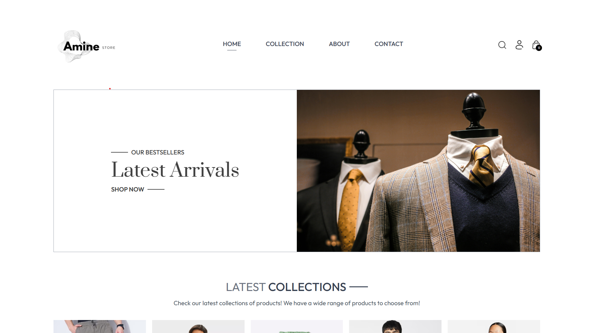 | 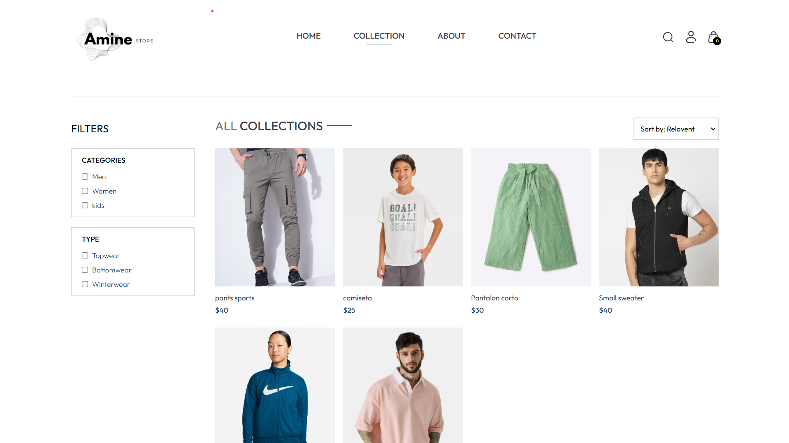 |

### ℹ️ About & Contact
| About | Contact |
|-------|---------|
| 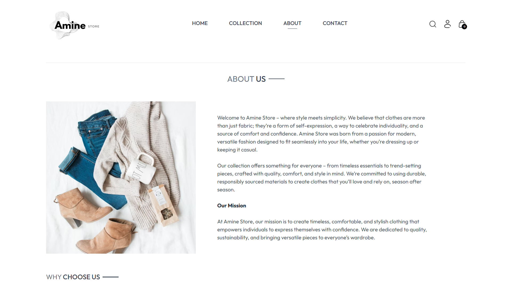 | 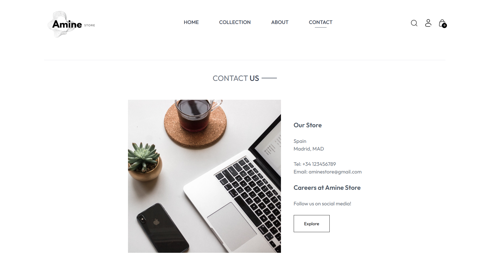 |

### 🔍 Search
| Search |
|--------|
| 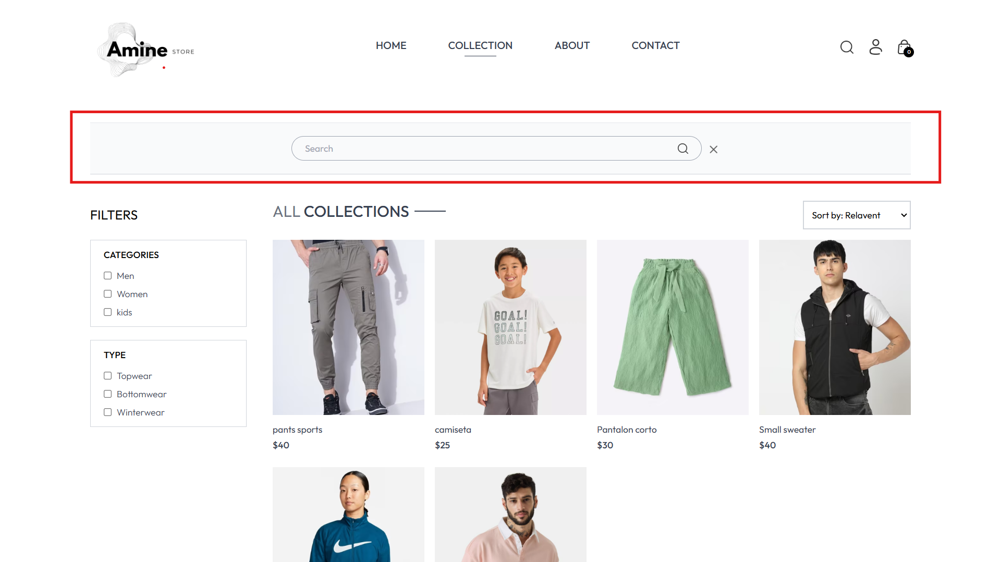 |

### 🔑 Authentication / Login
| Login |
|-------|
| 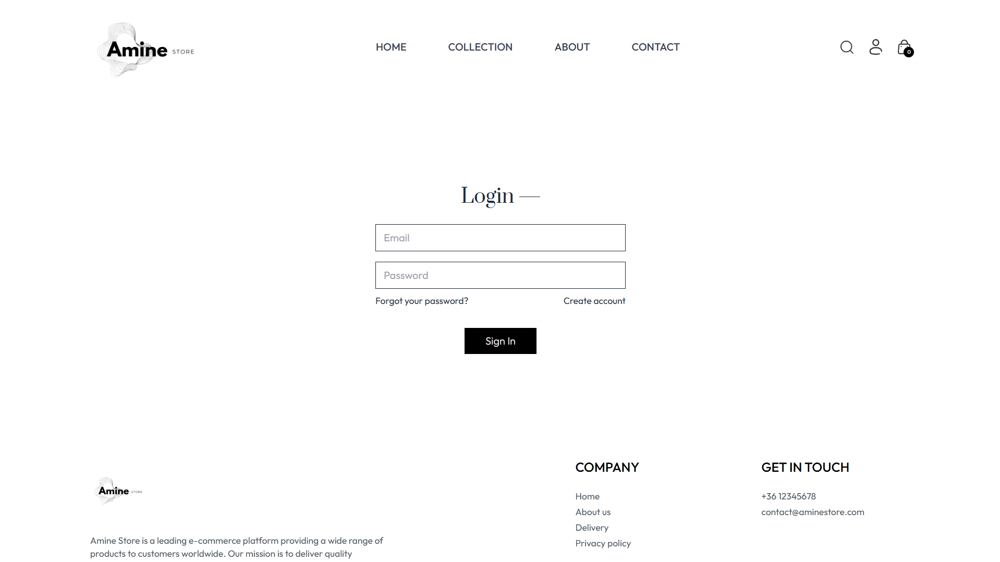 |

### 🛒 Shopping Cart & Checkout
| Add to Cart | Checkout |
|------------|---------|
|  | 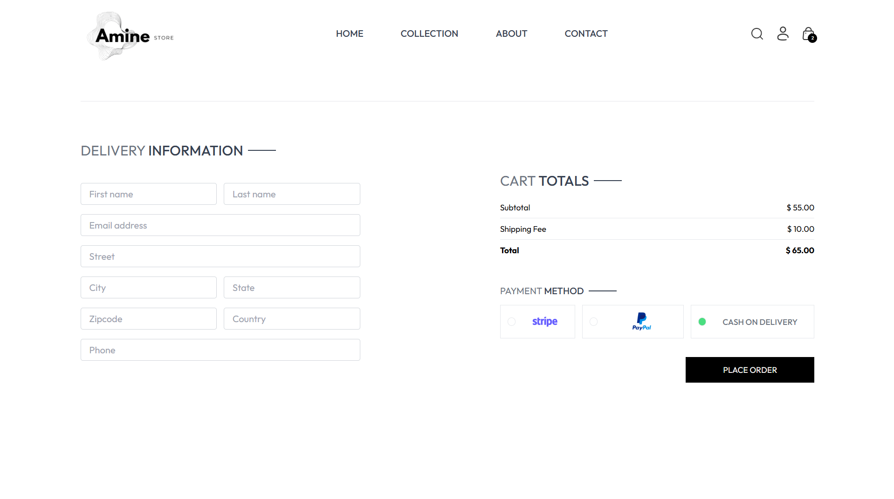 |

### ⚙️ Admin Panel (Product Management & Orders)
| Add Product | Product List | Orders |
|------------|--------------|--------|
|  | 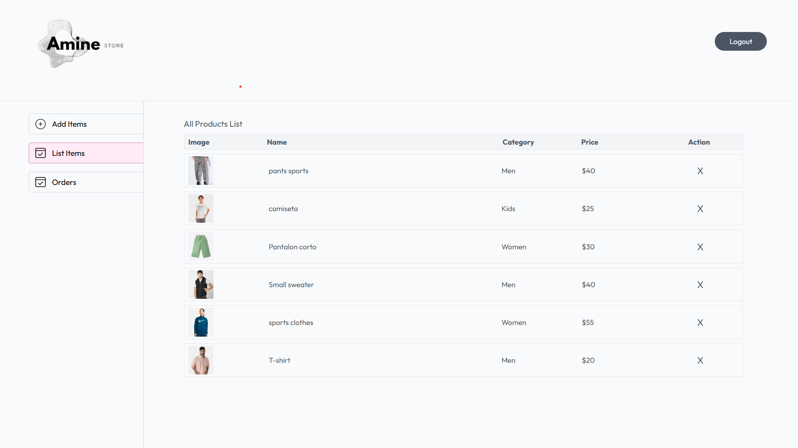 | 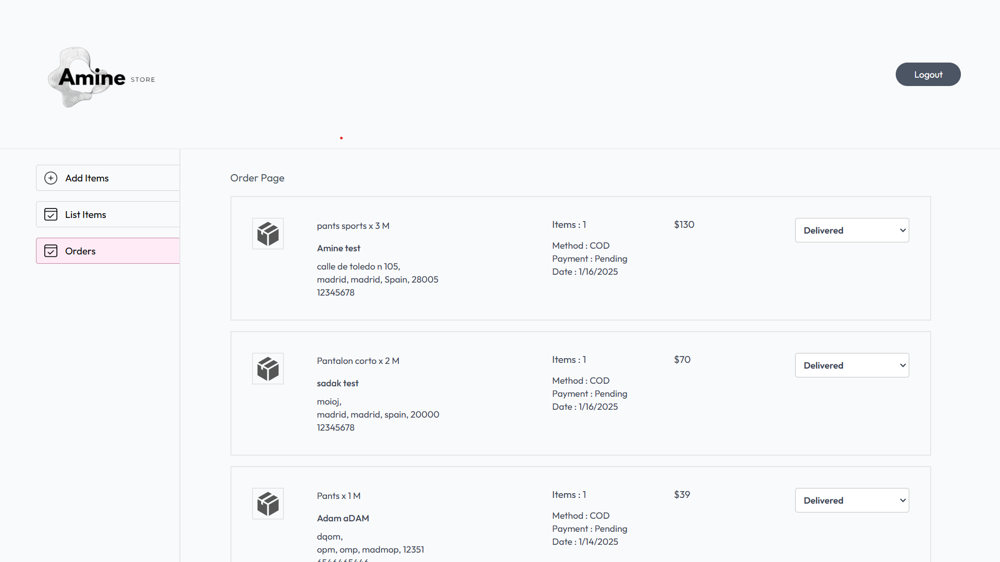 |

### 📱 Responsive Design  
| Mobile View | NavBar |
|------------|--------------|
| 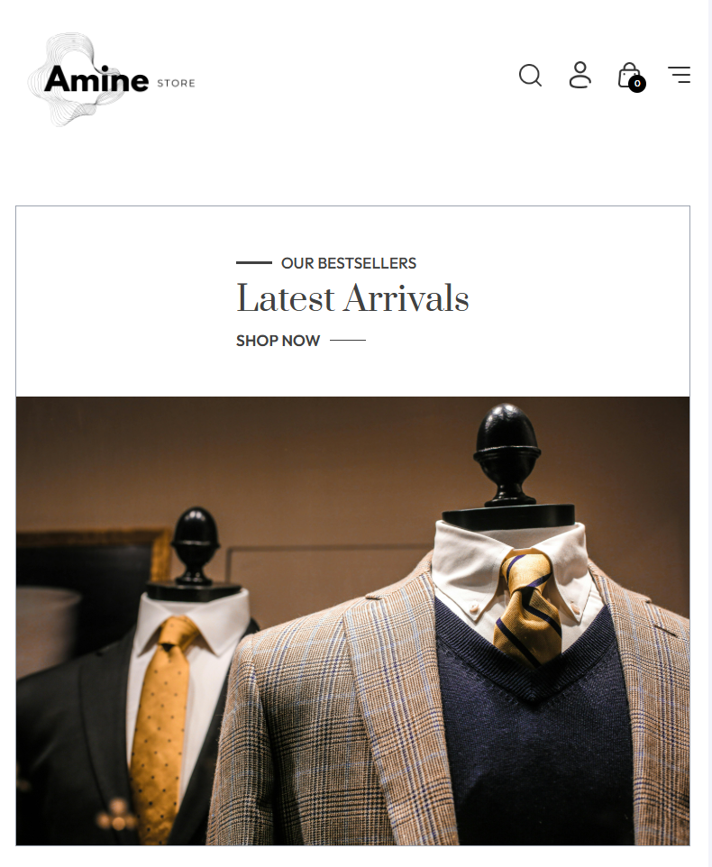 | 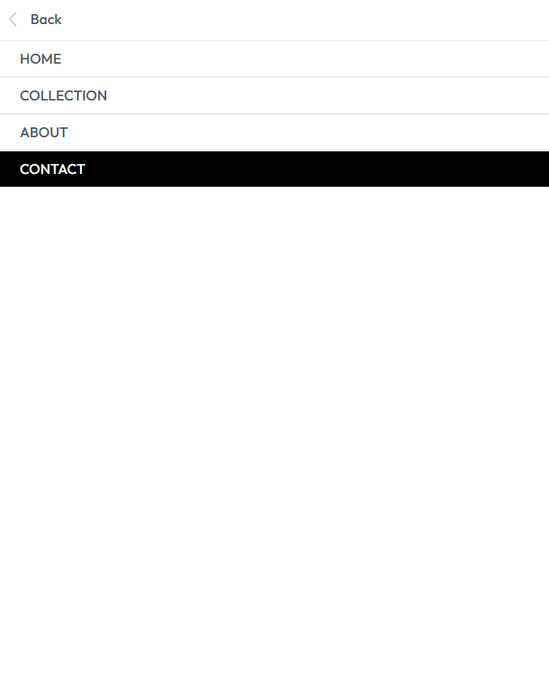 |


⚡ Future Improvements
💳 Payment Integration (Stripe, PayPal, Cash on Delivery)
📦 Order Tracking System
🌎 Multi-Language Support


